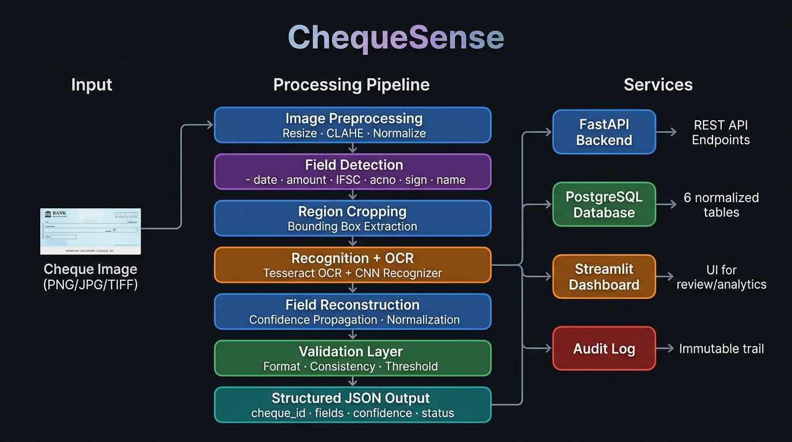

# ChequeSense

> **AI-Powered Bank Cheque Processing and Extraction System**  
> B.Tech CSE / Data Science Final Year Project

---

## Table of Contents

1. [Problem Statement](#1-problem-statement)
2. [Motivation](#2-motivation)
3. [Objectives](#3-objectives)
4. [System Architecture](#4-system-architecture)
5. [Dataset Description](#5-dataset-description)
6. [Dataset Sources](#6-dataset-sources)
7. [ML Methodology](#7-ml-methodology)
8. [Field Detection](#8-field-detection)
9. [Handwriting Recognition](#9-handwriting-recognition)
10. [OCR and NLP](#10-ocr-and-nlp)
11. [Validation](#11-validation)
12. [Database Architecture](#12-database-architecture)
13. [API Architecture](#13-api-architecture)
14. [Dashboard](#14-dashboard)
15. [Authentication](#15-authentication)
16. [Evaluation Metrics](#16-evaluation-metrics)
17. [Results](#17-results)
18. [Limitations](#18-limitations)
19. [Future Scope](#19-future-scope)
20. [Installation](#20-installation)
21. [Usage](#21-usage)
22. [Docker Instructions](#22-docker-instructions)
23. [Project Structure](#23-project-structure)

---

## 1. Problem Statement

Manual cheque processing in Indian banking is slow, error-prone, and labour-intensive. Bank tellers must visually read each field—payee name, amount, date, IFSC code, and account number—transcribe them into core banking systems, and manually verify formatting rules. This creates bottlenecks in high-volume branches, increases transcription errors, and raises operational costs.

ChequeSense addresses this problem by building an end-to-end automated pipeline that accepts a scanned or photographed cheque image, localises key fields using object detection, extracts field values using OCR and a handwritten digit recogniser, applies banking validation rules, and produces a structured JSON output suitable for downstream systems.

---

## 2. Motivation

- **Scale:** Indian banks collectively process hundreds of millions of cheques annually. Even partial automation reduces manual labour significantly.
- **Accuracy:** Human transcription errors in financial documents can have direct monetary consequences. A system that flags uncertain predictions for human review is safer than unassisted manual entry.
- **Research opportunity:** Cheque processing requires a heterogeneous ML stack—object detection, printed OCR, and handwritten recognition—making it a rich applied ML problem.
- **Responsible AI:** The system is designed to assist human reviewers, not replace them. Low-confidence predictions are always escalated for human review rather than auto-accepted.

---

## 3. Objectives

1. Build a modular, multi-stage ML pipeline for automated cheque field extraction.
2. Train a Faster R-CNN object detector to localise six field regions on synthetic cheque images.
3. Train a CNN-based handwritten digit recogniser on MNIST as a baseline.
4. Integrate Tesseract OCR for printed/typed text extraction from detected regions.
5. Design a confidence propagation system that assigns a composite confidence score to each extracted field.
6. Implement a business-rule validation layer that enforces format, date, and completeness constraints.
7. Build a normalised PostgreSQL persistence layer that stores predictions, extracted fields, and validation outcomes.
8. Expose the pipeline via a FastAPI REST backend with role-based access control.
9. Provide a Streamlit dashboard for upload, review, and analytics workflows.
10. Containerise the complete system using Docker and Docker Compose.
11. Perform honest evaluation on held-out test data and document both strengths and failures.

---

## 4. System Architecture



```
Cheque Image
    │
    ▼
┌─────────────────────────────────────────────┐
│             Image Preprocessing              │
│  Resize · CLAHE enhancement · Normalise     │
└────────────────────┬────────────────────────┘
                     ▼
┌─────────────────────────────────────────────┐
│            Field Detection                  │
│  Faster R-CNN → 6 bounding boxes            │
│  date · amount · IFSC · acno · sign · name  │
└────────────────────┬────────────────────────┘
                     ▼
┌─────────────────────────────────────────────┐
│         Recognition + OCR                   │
│  Tesseract OCR (text fields)                │
│  CNN Recogniser (numeric digit crops)       │
└────────────────────┬────────────────────────┘
                     ▼
┌─────────────────────────────────────────────┐
│        Field Reconstruction                 │
│  Composite confidence · Normalization       │
└────────────────────┬────────────────────────┘
                     ▼
┌─────────────────────────────────────────────┐
│          Validation Layer                   │
│  Format · Date · Required-field · Threshold │
│  PROCESSED / VERIFIED / REVIEW_REQUIRED /   │
│  INVALID                                    │
└────────────────────┬────────────────────────┘
                     │
             ┌───────┴───────┐
             ▼               ▼
        FastAPI          PostgreSQL
        REST API          Database
             │               │
             └───────┬───────┘
                     ▼
             Streamlit Dashboard
             (Upload · Review · Analytics)
```

---

## 5. Dataset Description

### 5.1 Synthetic Cheque Dataset (Field Detection)

Programmatically generated synthetic Indian bank cheque images created using Pillow. Randomised field values at randomised positions within a realistic cheque template. Ground-truth bounding boxes stored in COCO JSON format.

- **Training images:** ~280 | **Validation:** ~57 | **Test:** 43
- **Classes:** `date`, `amount`, `ifsc`, `acno`, `sign`, `name`
- **Format:** COCO JSON bounding box annotations

### 5.2 MNIST Handwritten Digit Dataset (Recognition)

Standard MNIST for CNN-based digit classification.

- **Train:** 60,000 | **Test:** 10,000
- **Classes:** 0–9
- **Format:** 28×28 greyscale images

> **Note:** MNIST provides isolated single-digit images. The recogniser classifies one digit at a time; multi-digit sequence reading is not supported by the current implementation.

### 5.3 IDRBT Cheque Image Dataset (OCR / Pipeline Evaluation)

A subset of real cheque images from the IDRBT dataset, used read-only for evaluation only—not used in training.

- **Pipeline test samples:** 212 images
- **Use:** OCR performance and end-to-end pipeline benchmarking

---

## 6. Dataset Sources

| Dataset | Source | Access |
|---|---|---|
| Synthetic Cheque Dataset | Generated in-project (`scripts/generate_synthetic_cheques.py`) | Local |
| MNIST | [yann.lecun.com/exdb/mnist](http://yann.lecun.com/exdb/mnist/) | `torchvision.datasets.MNIST` |
| IDRBT Cheque Images | [IDRBT, Hyderabad](https://www.idrbt.ac.in/) | Institutional / research access |

> Dataset files are excluded from the Docker image and the Git repository (see `.gitignore`).

---

## 7. ML Methodology

Three distinct ML components operate in sequence:

```
Input Image
    ├─→ [Faster R-CNN]       Field localisation → Bounding boxes + detection confidence
    ├─→ [Tesseract OCR]      Text extraction per cropped region → raw text + OCR confidence
    └─→ [CNN Classifier]     Digit classification for numeric crops → class + softmax probability
```

**Composite confidence:**

```
composite_confidence = detection_confidence × extraction_confidence
```

Fields with `composite_confidence < 0.60` are flagged for human review.

---

## 8. Field Detection

**Model:** Faster R-CNN with ResNet-50 FPN backbone, fine-tuned from ImageNet/COCO pre-trained weights.

**Training:** Input resize 1333×800, augmentations (flip, colour jitter, ±10° rotation), SGD momentum optimiser, 20 epochs, batch size 4.

### Detection Results (Synthetic Test Set — 43 images, 258 GT boxes)

| Field | Precision@50 | Recall@50 | F1@50 | AP@50 | AP@50:95 |
|---|---|---|---|---|---|
| date | 1.000 | 1.000 | 1.000 | 1.000 | 0.860 |
| amount | 1.000 | 1.000 | 1.000 | 1.000 | 0.806 |
| ifsc | 0.896 | 1.000 | 0.945 | 1.000 | 0.660 |
| acno | 1.000 | 1.000 | 1.000 | 1.000 | 0.782 |
| sign | 1.000 | 1.000 | 1.000 | 1.000 | 0.709 |
| name | 1.000 | 1.000 | 1.000 | 1.000 | 0.875 |
| **Mean** | **0.983** | **1.000** | **0.991** | **1.000** | **0.782** |

> These results are on synthetic test images from the same distribution as training. Generalisation to real cheques has not been validated.

---

## 9. Handwriting Recognition

**Model:** Four-layer CNN trained on MNIST for 10-class isolated digit classification.

### Recognition Results (IDRBT crops — 182 samples)

| Metric | Value |
|---|---|
| Accuracy | **42.86%** |
| Macro Precision | 0.4931 |
| Macro Recall | 0.4177 |
| Macro F1 | 0.4146 |

**Most confused pairs:** 1↔4 (7 errors), 1↔7 (6 errors), 4↔8 (5 errors)

> The 42.86% accuracy reflects the domain gap between MNIST (clean isolated digits) and real cheque digit crops (handwritten on coloured templates). The pipeline routes all low-confidence recognitions to human review.

---

## 10. OCR and NLP

**Engine:** Tesseract 5.x with field-specific page segmentation modes (PSM 7/8).

**Post-processing:** IFSC regex validation, leading-zero preservation, date normalisation to DD/MM/YYYY, amount decimal normalisation.

### OCR Results (IDRBT test set — 169 samples)

| Metric | Value |
|---|---|
| Word Exact Match Accuracy | **0.2%** |
| Word Error Rate (WER) | 99.8% |
| Date field presence rate | 89.4% |
| Amount field presence rate | 36.7% |
| Name field presence rate | 43.8% |

> Tesseract is optimised for printed text. The high WER on handwritten cheque fields is expected. The confidence propagation system correctly identifies these failures and routes them to REVIEW_REQUIRED or INVALID.

---

## 11. Validation

Rules applied after field extraction. **No fraud determinations are made.**

| Rule | Check Type | Action |
|---|---|---|
| Required fields present | `REQUIRED_FIELD` | INVALID if missing |
| IFSC format | `FORMAT` | REVIEW_REQUIRED if invalid |
| Account number format | `FORMAT` | REVIEW_REQUIRED if invalid |
| Date validity (not future, not >6 months old) | `DATE_VALIDITY` | REVIEW_REQUIRED |
| Confidence gate (composite ≥ 0.60) | `CONFIDENCE_GATE` | REVIEW_REQUIRED if below |

### Processing Statuses

| Status | Meaning |
|---|---|
| `PROCESSED` | Pipeline completed, validation pending |
| `VERIFIED` | All fields pass all validation rules |
| `REVIEW_REQUIRED` | One or more fields require human review |
| `INVALID` | Required field missing or hard rule failed |

Per field, the system preserves: `raw_value`, `normalized_value`, `confidence`, `detection_confidence`, `extraction_confidence`, `confidence_tier`, `validation_reason`.

---

## 12. Database Architecture

**PostgreSQL** via SQLAlchemy ORM. Seven normalised tables:

```
users · cheques · processing_runs · predictions ·
extracted_fields · validation_results · audit_logs
```

Image binaries are **not** stored in PostgreSQL. Only `image_path` (storage reference) is stored.

Credentials are supplied via environment variables only. See [`.env.example`](.env.example).

---

## 13. API Architecture

**FastAPI** REST backend with the following endpoints:

| Method | Path | Role | Description |
|---|---|---|---|
| POST | `/auth/register` | Public | Register user |
| POST | `/auth/login` | Public | Get JWT token |
| GET | `/auth/me` | Any | Current user info |
| POST | `/api/v1/cheques/upload` | EMPLOYEE/ADMIN | Upload cheque image |
| POST | `/api/v1/cheques/{id}/process` | EMPLOYEE/ADMIN | Run inference |
| GET | `/api/v1/cheques/{id}` | EMPLOYEE/REVIEWER/ADMIN | Cheque detail |
| GET | `/api/v1/cheques` | EMPLOYEE/ADMIN | List cheques |
| PATCH | `/api/v1/cheques/{id}/correct` | REVIEWER/ADMIN | Manual correction |
| GET | `/api/v1/analytics/summary` | ANALYST/ADMIN | Aggregate metrics |
| GET | `/api/v1/analytics/trends` | ANALYST/ADMIN | Volume trends |
| GET | `/api/v1/health` | Public | Liveness |

Interactive API docs: `http://localhost:8000/docs`

---

## 14. Dashboard

**Streamlit** dashboard — five pages:

| Page | Purpose |
|---|---|
| Upload | Drag-and-drop cheque image upload + processing |
| Results | Image, bounding boxes, extracted values, confidence, validation status |
| History | Paginated cheque history with filters |
| Review | REVIEW_REQUIRED queue; manual field correction by reviewers |
| Analytics | Volume trend, confidence distribution, review rate, field accuracy |

All ML logic runs in the FastAPI backend; the dashboard is a pure UI client.

---

## 15. Authentication

**JWT** tokens via `PyJWT`. **bcrypt** password hashing via `passlib`. Plaintext passwords are never stored.

| Role | Upload | Process | View | Review | Analytics | Admin |
|---|---|---|---|---|---|---|
| ADMIN | ✓ | ✓ | ✓ | ✓ | ✓ | ✓ |
| EMPLOYEE | ✓ | ✓ | ✓ | ✗ | ✗ | ✗ |
| REVIEWER | ✗ | ✗ | ✓ | ✓ | ✗ | ✗ |
| ANALYST | ✗ | ✗ | ✗ | ✗ | ✓ | ✗ |

**Audited actions:** LOGIN, UPLOAD_CHEQUE, PROCESS_CHEQUE, MANUAL_CORRECTION, STATUS_CHANGE.

---

## 16. Evaluation Metrics

- **Detection:** Precision@50, Recall@50, mAP@50, mAP@50:95
- **Recognition:** Accuracy, Macro P/R/F1, Confusion Matrix
- **OCR:** Word Exact Match, WER, Field Presence Rate
- **System:** Mean/Median/P95 Latency (ms), Peak RSS Memory (MB), Failure Rate

---

## 17. Results

### Field Detection (43 test images)

| Metric | Value |
|---|---|
| mAP@50 | **1.000** |
| mAP@50:95 | **0.782** |
| Mean Precision@50 | 0.983 |
| Mean Recall@50 | 1.000 |

### Handwriting Recognition (182 samples)

| Metric | Value |
|---|---|
| Accuracy | **42.86%** |
| Macro F1 | 0.415 |

### OCR (169 samples)

| Metric | Value |
|---|---|
| Word Exact Match | **0.2%** |
| WER | 99.8% |

### System Performance (212 runs, CPU)

| Metric | Value |
|---|---|
| Mean latency | **692 ms** |
| P95 latency | 1,302 ms |
| Failure rate | **0.0%** |
| Peak RSS | 3,374 MB |

---

## 18. Limitations

1. **Domain gap in recognition:** MNIST-trained CNN → 42.86% accuracy on real cheque digit crops. Not production-ready without fine-tuning on real data.
2. **Tesseract on handwritten text:** WER > 99% on handwritten fields. Requires a dedicated handwriting OCR model.
3. **Synthetic detector training:** Detector validated only on synthetic images; real-world generalisation not measured.
4. **No sequence recognition:** Single-digit classifier only; multi-digit strings require CRNN/CTC.
5. **English only:** No regional language support.
6. **No GPU benchmarks:** All measurements on CPU.
7. **Signature verification:** Presence detected only; no signature-against-reference verification.

---

## 19. Future Scope

1. Fine-tune recogniser on annotated real cheque digit crops, or replace with TrOCR/CRNN.
2. Replace Tesseract for handwritten fields with a sequence-to-sequence OCR model.
3. Augment synthetic detector training set with real cheque images.
4. Add CUDA support and GPU inference benchmarks.
5. Multi-language script support (Devanagari, Tamil, Bengali, etc.).
6. Siamese network signature verification against a reference.
7. MICR line reader for cheque number, sort code, and account number.
8. Active learning loop: surface low-confidence predictions for human annotation.

---

## 20. Installation

### Prerequisites

- Python 3.11+
- PostgreSQL 14+
- Tesseract 5.x

```bash
# Install Tesseract (Debian/Ubuntu)
sudo apt install tesseract-ocr tesseract-ocr-eng
```

### Steps

```bash
git clone https://github.com/<your-org>/ChequeSense.git
cd ChequeSense

python -m venv .venv && source .venv/bin/activate

pip install --upgrade pip
pip install -r requirements.txt

cp .env.example .env          # Fill in DATABASE_URL, SECRET_KEY, model paths

alembic upgrade head          # Initialise database schema
```

Place model weights at `models/field_detector/best_model.pt` and `models/recognizer/best_model.pt`.

---

## 21. Usage

### CLI

```bash
python -m src.pipeline.pipeline \
  --image path/to/cheque.jpg \
  --output result.json \
  --device cpu
```

### API Server

```bash
uvicorn api.main:app --host 0.0.0.0 --port 8000 --reload
# Swagger docs: http://localhost:8000/docs
```

### Dashboard

```bash
streamlit run dashboard/app.py
# UI: http://localhost:8501
```

---

## 22. Docker Instructions

```bash
docker compose build
docker compose up -d

# Verify
curl http://localhost:8000/api/v1/health

# Logs
docker compose logs -f api

# Stop
docker compose down
```

| Service | URL |
|---|---|
| API | http://localhost:8000 |
| Dashboard | http://localhost:8501 |
| API Docs | http://localhost:8000/docs |

> Never commit `.env` to version control. Model binaries and dataset files are mounted as volumes, not baked into the image.

See [`docs/DEPLOYMENT.md`](docs/DEPLOYMENT.md) for the full deployment guide.

---

## 23. Project Structure

```
ChequeSense/
├── api/                        # FastAPI REST backend
│   ├── main.py
│   ├── dependencies.py
│   ├── schemas.py
│   └── routes/
│       ├── auth.py
│       ├── cheque.py
│       ├── analytics.py
│       └── health.py
├── src/                        # Core library
│   ├── pipeline/               # End-to-end inference pipeline
│   ├── detection/              # Faster R-CNN model & training
│   ├── recognition/            # CNN recogniser model & training
│   ├── ocr/                    # Tesseract OCR engine
│   ├── validation/             # Business-rule validation
│   ├── database/               # SQLAlchemy + PostgreSQL
│   ├── analytics/              # Queries, metrics, trends, reports
│   └── security/               # JWT auth + audit logging
├── dashboard/                  # Streamlit frontend
│   ├── app.py
│   ├── pages/
│   └── components/
├── tests/                      # Pytest test suite
├── reports/                    # Evaluation outputs
│   ├── model_evaluation.md
│   ├── error_analysis.md
│   └── final_metrics.json
├── docs/                       # Documentation
│   ├── ARCHITECTURE.md
│   ├── DATASET.md
│   ├── ML_PIPELINE.md
│   ├── DATABASE.md
│   ├── API.md
│   ├── SECURITY.md
│   ├── EVALUATION.md
│   ├── DEPLOYMENT.md
│   ├── architecture_diagram.jpg
│   └── workflow_diagram.jpg
├── scripts/
├── models/                     # Model checkpoints (gitignored)
├── Dataset/                    # Dataset files (gitignored)
├── Dockerfile
├── docker-compose.yml
├── .env.example
└── requirements.txt
```

---

## License

Developed for academic purposes as a B.Tech CSE / Data Science final year project.  
All datasets are either synthetically generated, publicly available (MNIST), or used under institutional research access terms (IDRBT).

---

*ChequeSense — AI-powered cheque field extraction with confidence-based human-in-the-loop review.*
