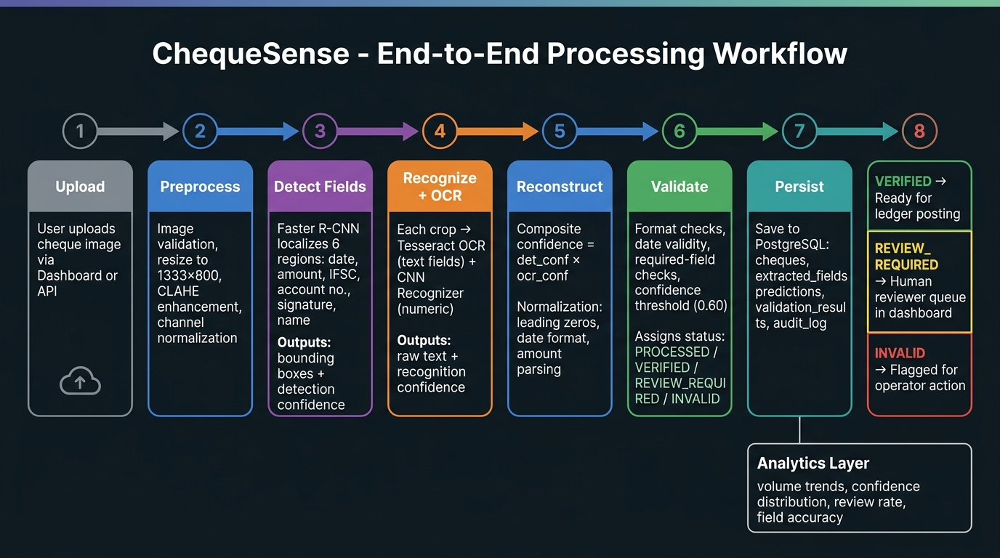

# ChequeSense — System Architecture

## Overview

ChequeSense is structured as a layered, modular system. A cheque image enters via the API or Streamlit dashboard, traverses a multi-stage ML inference pipeline, is validated against banking business rules, persisted in PostgreSQL, and the result is surfaced back to the user.

The design philosophy is:

- **Modular pipeline:** Each stage (preprocessing, detection, OCR, reconstruction, validation) is an independently testable Python module.
- **Separation of concerns:** ML inference logic lives in `src/`; API routing in `api/`; UI in `dashboard/`. No ML code runs inside the dashboard or routes.
- **Configuration-driven:** Model paths, thresholds, and database credentials are environment-variable driven — no hard-coded values.
- **Human-in-the-loop by design:** Low-confidence or invalid fields are never silently accepted. They are always routed to the human review queue.

---

## Diagrams

### System Architecture


### End-to-End Processing Workflow



---

## Layer Breakdown

### 1. Input Layer

Cheque images are accepted as:
- File upload via `POST /api/v1/cheques/upload` (FastAPI)
- File upload via the Streamlit Upload page

Accepted formats: `image/jpeg`, `image/png`, `image/tiff`  
Maximum file size: 10 MB  
Filename: UUID-based (safe, non-guessable)  
Deduplication: SHA-256 hash of image bytes

### 2. ML Inference Pipeline (`src/pipeline/`)

Five sequential stages orchestrated by `ChequeInferencePipeline`:

```
preprocess.py  →  detect_fields.py  →  ocr.py + recognize.py  →  reconstruct.py
```

| Module | Responsibility |
|---|---|
| `preprocess.py` | Load image, validate format, resize to fit 1333×800, apply CLAHE |
| `detect_fields.py` | Run Faster R-CNN, filter boxes by confidence, crop field regions |
| `ocr.py` | Run Tesseract on each crop with field-specific PSM |
| `recognize.py` | Run CNN digit classifier on numeric field crops |
| `reconstruct.py` | Merge OCR + recognition outputs, compute composite confidence, normalise values |

Output: `ChequePipelineResult` (Pydantic model) — structured JSON with per-field values and confidence scores.

### 3. Validation Layer (`src/validation/`)

Applied after pipeline execution:

```
field_validator.py  →  confidence.py  →  consistency.py  →  review_queue.py
```

Assigns one of four statuses: `PROCESSED`, `VERIFIED`, `REVIEW_REQUIRED`, `INVALID`.

### 4. Persistence Layer (`src/database/`)

SQLAlchemy ORM with PostgreSQL. Seven normalised tables.

Image files stored on local filesystem (or object storage). Only the path/URI stored in PostgreSQL.

Alembic manages schema migrations.

### 5. API Layer (`api/`)

FastAPI application with four route groups:
- `/auth` — JWT authentication
- `/api/v1/cheques` — Cheque CRUD and processing
- `/api/v1/analytics` — Aggregate metrics
- `/api/v1/health` — Liveness

### 6. Dashboard (`dashboard/`)

Streamlit multi-page application. Communicates exclusively via HTTP to the FastAPI backend through `BackendClient` (`dashboard/components/api_client.py`).

### 7. Security Layer (`src/security/`)

- `auth.py` — JWT token issuance/validation, bcrypt password hashing, RBAC role checking
- `audit.py` — Immutable audit event recording into `audit_logs` table

---

## Data Flow

```
[User] ──upload──→ [FastAPI /upload]
                        │ validate MIME, size
                        │ generate UUID filename
                        │ compute SHA-256
                        │ write file to UPLOAD_DIR
                        │ INSERT cheques row
                        ↓
[User] ──process──→ [FastAPI /process]
                        │ load ChequeInferencePipeline (singleton)
                        │ pipeline.process(image)
                        │   ├─ preprocess
                        │   ├─ detect_fields (Faster R-CNN)
                        │   ├─ ocr (Tesseract)
                        │   ├─ recognize (CNN)
                        │   └─ reconstruct + confidence propagation
                        │ validate (rules + threshold)
                        │ save_pipeline_execution (PostgreSQL)
                        │   ├─ INSERT processing_runs
                        │   ├─ INSERT predictions (raw model output)
                        │   ├─ INSERT extracted_fields (normalised)
                        │   └─ INSERT validation_results
                        │ record_audit_event
                        ↓
[Dashboard] ──GET─→ [FastAPI /cheques/{id}]
                        └─ SELECT all related tables
                           → ChequeDetailResponse JSON
```

---

## Technology Choices

| Component | Technology | Reason |
|---|---|---|
| Field detection | Faster R-CNN (torchvision) | Standard object detection; good off-the-shelf performance on structured documents |
| Handwriting recognition | Custom CNN | Lightweight; MNIST baseline sufficient for proof-of-concept |
| OCR engine | Tesseract 5 | Open-source; no external API dependency |
| API framework | FastAPI | Async, auto-generates OpenAPI docs, excellent Pydantic integration |
| Database ORM | SQLAlchemy 2 | Industry-standard Python ORM; type-safe mapped columns |
| Migrations | Alembic | Standard SQLAlchemy migration tool |
| Dashboard | Streamlit | Rapid development; native support for data and chart components |
| Containerisation | Docker + Docker Compose | Reproducible deployment; service isolation |
| Auth | PyJWT + passlib bcrypt | Industry-standard JWT; bcrypt is the correct choice for password hashing |

---

## Configuration

All runtime parameters are loaded from environment variables. The `PipelineConfig` Pydantic model reads from environment at startup:

```
DETECTOR_MODEL_PATH   = models/field_detector/best_model.pt
RECOGNIZER_MODEL_PATH = models/recognizer/best_model.pt
DEVICE                = cpu
CONFIDENCE_THRESHOLD  = 0.60
TESSERACT_CMD         = /usr/bin/tesseract
DATABASE_URL          = postgresql://...
SECRET_KEY            = <min 32 chars>
UPLOAD_DIR            = data/uploads
```

See [`.env.example`](../.env.example) for the full list.
