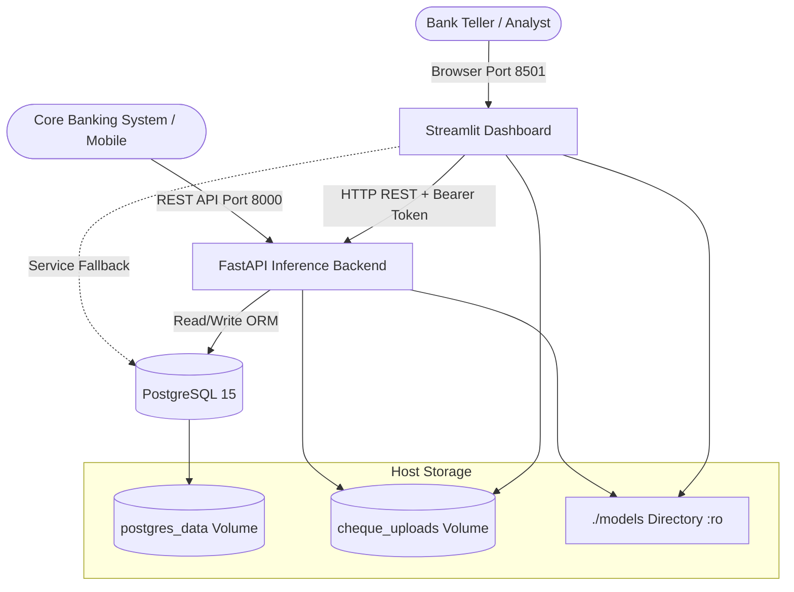

# ChequeSense Enterprise Deployment & Containerization Guide

**Version:** 1.0.0  
**Target Environment:** Docker & Docker Compose (Production / On-Premise / Cloud VM)  
**Supported Platforms:** Linux (x86_64, aarch64), macOS (Apple Silicon via Docker Desktop)  

---

## 1. Architectural Overview

ChequeSense is containerized into a microservice architecture orchestrated via Docker Compose:



### Services Summary

| Service Name | Container Name | Base Image | Internal Port | External Port | Healthcheck Endpoint |
| :--- | :--- | :--- | :---: | :---: | :--- |
| **`postgres`** | `chequesense-postgres` | `postgres:15-alpine` | `5432` | `5432` | `pg_isready -U postgres -d chequesense` |
| **`api`** | `chequesense-api` | `chequesense:latest` | `8000` | `8000` | `GET /api/v1/health` |
| **`dashboard`** | `chequesense-dashboard`| `chequesense:latest` | `8501` | `8501` | `GET /_stcore/health` |

---

## 2. Prerequisites & Resource Allocation

- **Docker Engine:** Version 24.0+ (or Docker Desktop 4.20+)
- **Docker Compose:** Version 2.20+ (included in standard Docker CLI)
- **Minimum System Requirements:**
  - **CPU:** 2 vCPUs (4 vCPUs recommended for concurrent batch processing)
  - **RAM:** 4 GB available memory (8 GB recommended for simultaneous Faster R-CNN + Tesseract inference)
  - **Disk Space:** 5 GB free disk space (models + base dependencies)

---

## 3. Environment Variable Configuration

All services are configured through environment variables. An example template is provided in [`.env.example`](file:///Users/karansingh/ChequeSense/.env.example).

To customize your deployment credentials:
```bash
cp .env.example .env
chmod 600 .env
```

### Key Configuration Parameters

| Variable Name | Default Value | Description |
| :--- | :--- | :--- |
| `POSTGRES_USER` | `postgres` | PostgreSQL administrative username |
| `POSTGRES_PASSWORD` | `postgres` | Secure database user password |
| `POSTGRES_DB` | `chequesense` | Database schema name |
| `POSTGRES_PORT` | `5432` | Host port mapped to PostgreSQL |
| `JWT_SECRET_KEY` | `09d25e...` | Secret key for signing HS256 auth tokens |
| `DEFAULT_ADMIN_USER` | `admin` | Default administrative account username |
| `DEFAULT_ADMIN_PASSWORD` | `AdminPassword123!` | Initial administrator password |
| `CHEQUESENSE_API_URL` | `http://api:8000/api/v1` | Internal API endpoint used by the dashboard |
| `UPLOAD_DIR` | `/app/data/uploads` | Path to persistent cheque image storage |
| `DETECTOR_MODEL_PATH` | `/app/models/field_detector/best_model.pt` | Path to Faster R-CNN checkpoint |
| `RECOGNIZER_MODEL_PATH` | `/app/models/recognizer/best_model.pt` | Path to Digit Recognizer checkpoint |
| `TESSERACT_CMD` | `/usr/bin/tesseract` | Path to Tesseract OCR engine executable |

> [!IMPORTANT]
> The `.dockerignore` file explicitly excludes `.env` and all secret files from being baked into the Docker image, strictly enforcing the 12-factor application methodology.

---

## 4. Building and Starting Services

### 4.1 Build the Application Image
Build the unified production image containing the FastAPI backend and Streamlit dashboard:
```bash
docker compose build
```

*Note: The build utilizes Debian 12 (Bookworm) `python:3.11-slim`, installs CPU-optimized PyTorch wheels directly from the PyTorch index, and pre-compiles dependencies for fast, layer-cached builds.*

### 4.2 Start All Services in Background Mode
```bash
docker compose up -d
```

### 4.3 Verify Container Status
Check service states and healthcheck reports:
```bash
docker compose ps
```
Expected output:
```text
NAME                    IMAGE               COMMAND                  SERVICE     CREATED         STATUS                   PORTS
chequesense-api         chequesense:latest  "uvicorn api.main:ap…"   api         2 minutes ago   Up 2 minutes (healthy)   0.0.0.0:8000->8000/tcp
chequesense-dashboard   chequesense:latest  "streamlit run dashb…"   dashboard   2 minutes ago   Up 2 minutes (healthy)   0.0.0.0:8501->8501/tcp
chequesense-postgres    postgres:15-alpine  "docker-entrypoint.s…"   postgres    2 minutes ago   Up 2 minutes (healthy)   0.0.0.0:5432->5432/tcp
```

---

## 5. Health Verification & Operational Checks

### 5.1 Backend API Healthcheck
Test the API diagnostic endpoint:
```bash
curl -s http://localhost:8000/api/v1/health | jq .
```
Expected response:
```json
{
  "status": "healthy",
  "version": "1.0.0",
  "timestamp": "2026-10-01T02:25:00.000000",
  "database": "connected",
  "pipeline": "available"
}
```

### 5.2 Streamlit Dashboard Liveness
Test the Streamlit internal health probe:
```bash
curl -I http://localhost:8501/_stcore/health
```
Expected response: `HTTP/1.1 200 OK`

### 5.3 PostgreSQL Database Verification
Inspect the database tables automatically generated on startup:
```bash
docker compose exec postgres psql -U postgres -d chequesense -c "\dt"
```
Expected table list:
- `users`
- `cheques`
- `extracted_fields`
- `predictions`
- `validation_results`
- `processing_runs`
- `review_audit_logs`

---

## 6. End-to-End Cheque Processing Test

### 6.1 Authenticate and Obtain JWT Bearer Token
```bash
TOKEN=$(curl -s -X POST http://localhost:8000/auth/login \
  -H "Content-Type: application/json" \
  -d '{"username": "admin", "password": "AdminPassword123!"}' \
  | jq -r .access_token)

echo "JWT Access Token: $TOKEN"
```

### 6.2 Upload a Test Cheque Image
```bash
UPLOAD_RES=$(curl -s -X POST http://localhost:8000/api/v1/cheques/upload \
  -H "Authorization: Bearer $TOKEN" \
  -F "file=@artifacts/pipeline/test_cheques/sample_icici.png")

CHEQUE_ID=$(echo $UPLOAD_RES | jq -r .id)
echo "Uploaded Cheque ID: $CHEQUE_ID"
```

### 6.3 Trigger AI Pipeline Inference
```bash
curl -s -X POST http://localhost:8000/api/v1/cheques/$CHEQUE_ID/process \
  -H "Authorization: Bearer $TOKEN" | jq .
```

---

## 7. Operational Best Practices

### 7.1 Model Loading Efficiency
- PyTorch models (`best_model.pt`) are loaded once during container startup as memory singletons using `@lru_cache(maxsize=1)` in `api.dependencies.get_pipeline()`.
- Sequential HTTP requests do not re-read weights from disk or re-instantiate convolutional layers, preserving CPU cache locality.
- Models are mounted `:ro` (read-only) inside containers to prevent accidental corruption or modification.

### 7.2 Safe File Storage & Volume Management
- Cheque uploads are stored under `/app/data/uploads` inside the named volume `cheque_uploads`.
- Images are named via cryptographic SHA-256 hashes (`{uuid}_{hash[:16]}.png`) to eliminate path traversal vulnerabilities.
- Data persistence survives container restarts and upgrades:
  ```bash
  # Check storage volume details
  docker volume inspect chequesense_cheque_uploads
  docker volume inspect chequesense_postgres_data
  ```

### 7.3 Log Aggregation
View real-time structured logs from all services:
```bash
# All services
docker compose logs -f

# Specific service with timestamps
docker compose logs -f --timestamps api
```

### 7.4 Stopping and Cleaning Up
```bash
# Graceful stop
docker compose down

# Stop and wipe all persistent volumes (CAUTION: Destroys DB records)
docker compose down -v
```
